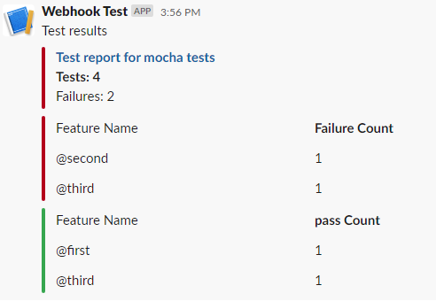

# mochawesome-slack-reporter
A simple reporter for publishing your mochawesome test reports to slack. This utility will take your mochawesome json report as input and publish results on slack webhook url provided. The results will be displayed in the tabluar format with the clear breakup of pass fail for each tag.

Instructions to use are as below.

1. installation
   
   `npm install mochawesome-slack-reporter`
2. Tagging tests
   Tag each test case/suite with tags in the format @tagName e.ge
   ```
   decribe("This is first@tag",()=>{
        it("Should be second @tag",()=>{
            ...
        })
   })
   ```
3. Publishing results
 ```
 const reporter = require('mochawesome-slack-reporter');  
(async () => {  
    await reporter.pushToSlack({  
        slackWebHookUrl: <webhook rul>,  
        pathToReport: 'mochawesome-report/mochawesome.json',  
        publishPassed: true,  
        title: "Mocha tests report",  
        info: <branch name>,  
        link: <Link to your execution i.e. pipeline>  
  }).catch((err) => {  
        console.log("error occurred")  
    })  
})()
```

The results will appear like this. Obviously you can toggle reporting of passed features by changing value of publishPassed parameter.




